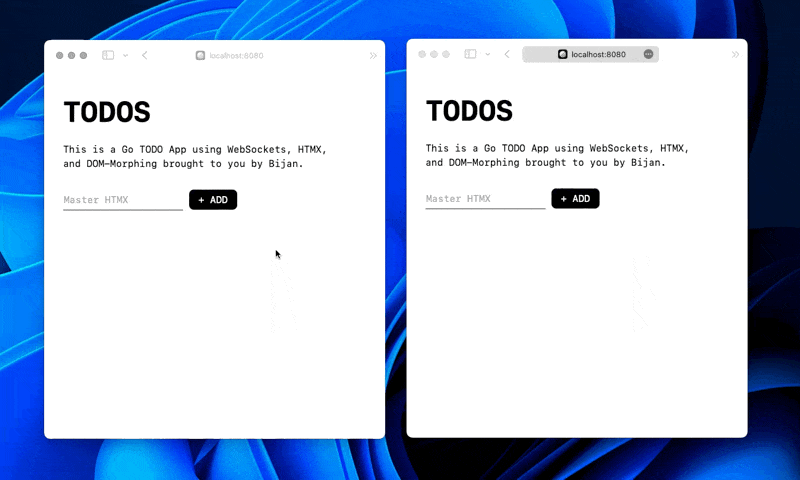

# go-htmx-todo
This is a Go TODO App using WebSockets, HTMX, and DOM-Morphing.

See: https://screenisland.com/2023/12/11/go-websockets-htmx-morphing-is-fun/

## Run it

Standard way:

    go run main.go

In case you have `air` installed, you can run it with:

    air
